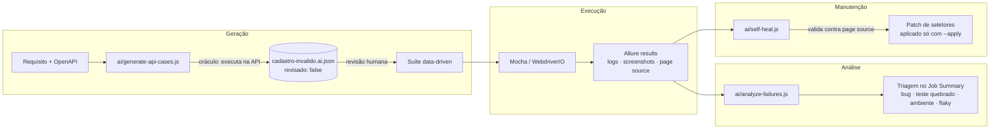

# QA Automation com IA — Desafio Banco Carrefour

Automação de testes de **API** e **Mobile** com uma **camada de IA** aplicada à geração, execução, manutenção e análise dos testes.

| | Stack |
|---|---|
| API | Node.js · Mocha · Chai · Axios · AJV (contrato) · Allure |
| Mobile | WebdriverIO v9 · Appium 2 (UiAutomator2 / XCUITest) · Mocha · Chai · Allure · BrowserStack |
| IA | OpenAI, Google Gemini ou Claude (Anthropic), trocáveis por configuração · saída estruturada validada com JSON Schema (AJV) |
| CI/CD | GitHub Actions (principal) · GitLab CI (equivalente) |

## Resultados

| Suíte | Ambiente | Resultado |
|---|---|---|
| API | ServeRest local, Node.js 22 | **54/54** ✅ (3 casos gerados por IA e revisados por mim), mais 5 divergências conhecidas que falham por design (seção 3) |
| Mobile · Android | Emulador Pixel 7, Android 14 (API 34), macOS | **13/13** ✅: os 10 cenários, com o CT03 rodando 4 conjuntos de dados, em 2 min 10 s |
| Mobile · iOS | Simulador iPhone 17 Pro, iOS 26.5, macOS | **13/13** ✅: os mesmos 10 cenários. No pipeline (simulador do GitHub) o job ainda roda sem bloquear, até a validação lá |
| Camada de IA | Testes unitários (`node --test`) | **7/7** ✅ |
| Geração de casos com IA | OpenAI `gpt-4o-mini`, execução real | 9 casos propostos: 3 aprovados, 1 bug provável (KI-05) e 5 rejeitados com justificativa. Detalhes em [docs/evidencias/geracao-ia-openai.md](docs/evidencias/geracao-ia-openai.md) |

Os screenshots da execução Android estão em [docs/evidencias/android](docs/evidencias/android). Também está documentado o caso real do self-healing, que diagnosticou "tela errada" na primeira execução: [docs/evidencias/self-heal-1a-execucao.md](docs/evidencias/self-heal-1a-execucao.md).

---

## Sumário
1. [Visão geral e arquitetura](#1-visão-geral-e-arquitetura)
2. [Como a IA é aplicada](#2-como-a-ia-é-aplicada)
3. [Desafio de API](#3-desafio-de-api)
4. [Desafio Mobile](#4-desafio-mobile)
5. [Pipeline CI/CD](#5-pipeline-cicd)
6. [Como executar](#6-como-executar)
7. [Decisões técnicas](#7-decisões-técnicas)

---

## 1. Visão geral e arquitetura

```
carrefour-qa-ai/
├── api/        # Desafio de API (ServeRest)
├── mobile/     # Desafio Mobile (native-demo-app)
├── ai/         # Camada de IA compartilhada pelos dois desafios
├── docs/       # Matriz de cobertura
├── .github/workflows/ci.yml
└── .gitlab-ci.yml
```



**Princípio central:** a IA **nunca decide se um teste passou ou falhou**. Ela gera, sugere e analisa; as asserções continuam determinísticas. Toda saída da IA é estruturada (JSON Schema) e **validada por código** antes de ser usada: casos gerados são executados contra a API, seletores sugeridos são conferidos no page source real.

## 2. Como a IA é aplicada

| Etapa | O que faz | Onde |
|---|---|---|
| **Geração** | Lê o requisito do desafio, o contrato OpenAPI e os casos existentes, e propõe casos negativos novos (fronteira, tipos, injeção, combinações). Cada caso é **executado contra a API** e marcado como `confere` ou `DIVERGE`. Só entra na suíte depois de um humano marcar `"revisado": true`. | `ai/generate-api-cases.js` → `api/data/*.ai.json` |
| **Execução** | Os casos revisados rodam no mesmo teste data-driven dos casos manuais, identificados no Allure com a tag `origem:ia`. No mobile, cada falha grava automaticamente a evidência que a IA vai precisar: screenshot, page source XML e um registro estruturado. | `api/test/usuarios/cadastrar.spec.js`, `mobile/config/wdio.shared.conf.js` |
| **Manutenção** | *Self-healing assistido*: quando um seletor quebra, a IA recebe o page source e o screenshot e sugere o seletor equivalente. A sugestão é **validada contra o XML real** e vira um patch para `mobile/test/locators.json`, aplicado só com `--apply`, depois de revisão. | `ai/self-heal.js` |
| **Análise** | Lê o `allure-results`, agrupa as falhas por causa-raiz e classifica cada uma (bug de produto, teste quebrado, ambiente, flaky ou divergência de requisito), com evidência e próxima ação. No mobile é multimodal (envia os screenshots). O resultado aparece no **Job Summary** do pipeline. | `ai/analyze-failures.js` |

**Por que o self-healing não é automático em tempo de execução?** Se o teste "se curasse" sozinho durante a execução, uma regressão real (um botão que sumiu da tela) passaria como sucesso. Aqui o teste falha, a IA explica e propõe a correção, e uma pessoa decide. Quando a IA conclui `tela-errada` ou `elemento-ausente`, a recomendação é abrir bug, não mexer no teste.

**Funciona sem chave de API.** Sem `OPENAI_API_KEY`, `GEMINI_API_KEY` ou `ANTHROPIC_API_KEY`, a triagem e o self-healing usam heurísticas (regras e similaridade de texto), e a geração de casos é pulada. O pipeline nunca quebra por causa da IA.

**Governança:**
- Prompts versionados em `ai/prompts/`.
- Fornecedor (`AI_PROVIDER`) e modelo (`AI_MODEL`) configuráveis: a camada é agnóstica ao LLM, com OpenAI, Gemini e Claude implementados.
- Uso de tokens registrado no relatório.
- Falhas `@known-issue` não gastam tokens.
- Senhas mascaradas nos logs anexados.
- A própria camada de IA tem testes unitários (`ai/test`).

**IA também no desenvolvimento:** este repositório foi construído com apoio do Claude Code, que ajudou a ler o código-fonte do native-demo-app para mapear os `testID`s reais, a sondar o ServeRest para descobrir os comportamentos de borda e a revisar o código. Todas as decisões de estratégia e todas as asserções foram revisadas por mim.

## 3. Desafio de API

**59 testes**: 54 na suíte principal (51 escritos à mão e 3 gerados por IA e revisados) e 5 divergências conhecidas, organizados por endpoint.

| Pasta | Conteúdo |
|---|---|
| `api/src/client` | Cliente HTTP (axios) que anexa request/response de cada chamada ao Allure (log de execução) |
| `api/src/services` | Service Objects (`UsuariosService`, `LoginService`, ...) |
| `api/src/schemas` | Contratos JSON Schema, com `additionalProperties: false` para detectar campos novos ou removidos |
| `api/src/factories` | Massa de dados com Faker e limpeza automática de tudo que a suíte cria |
| `api/data` | Casos data-driven: manuais (`.json`) e gerados por IA (`.ai.json`) |
| `api/test` | Specs por endpoint, autenticação, não funcionais e divergências conhecidas |

A matriz completa endpoint × status × cenário está em **[docs/cobertura-api.md](docs/cobertura-api.md)**.

### Divergências encontradas (requisito/boas práticas × ServeRest)

Descrevem o comportamento **esperado**, falham hoje e rodam num job separado (`@known-issue`) que não bloqueia o pipeline:

| Id | Severidade | Divergência |
|---|---|---|
| KI-01 | Crítica | A API aceita `Fulano@x.com` e `fulano@x.com` como contas diferentes (e-mail tratado como case-sensitive) |
| KI-02 | Crítica | `GET /usuarios` devolve a **senha em texto puro** |
| KI-03 | Normal | O requisito pede limite de 100 req/min; a API não aplica rate limit (nenhum 429) |
| KI-04 | Menor | Recurso inexistente retorna 400 em vez de 404 |
| KI-05 | Normal | Nome só com espaços é aceito. **Encontrado pela geração de casos com IA** (CAD-IA-05) e confirmado na revisão |

Também documentado: `PUT` em id inexistente **cria** o usuário (upsert, 201), e a suíte cobre esse comportamento.

## 4. Desafio Mobile

App: [native-demo-app](https://github.com/webdriverio/native-demo-app), versão fixada em **v2.2.0** para a execução ser reproduzível.

| # | Cenário | Categoria |
|---|---|---|
| CT01 | Login com credenciais válidas (alerta de sucesso) | Login/Cadastro |
| CT02 | Cadastro com dados válidos | Login/Cadastro |
| CT03 | Validações do login — **data-driven** (`test/data/login-invalido.json`, 4 conjuntos) | Mensagens de erro |
| CT04 | Cadastro com confirmação de senha diferente | Mensagens de erro |
| CT05 | Navegação por todas as abas da barra inferior | Navegação |
| CT06 | Navegação pelo menu lateral até telas fora da barra (Permissions, Data) | Navegação |
| CT07 | Swipe no carrossel até o último card | Navegação/gestos |
| CT08 | Campo de texto refletido na tela + switch ON/OFF | Formulários |
| CT09 | Seleção no dropdown | Formulários |
| CT10 | Botão ativo abre alerta; botão inativo não reage | Formulários |

**Organização:**
- **Page Objects** em `mobile/test/pageobjects`.
- **Repositório central de seletores** em `mobile/test/locators.json`: um só lugar para manter, e é esse arquivo que o self-healing corrige.
- Os seletores usam os `testID`s do app, lidos direto do código-fonte, e são os mesmos em Android e iOS. Onde a plataforma difere (alertas nativos, dropdown), o JSON tem uma entrada por plataforma.

**Evidências automáticas:**
- Screenshot ao fim de **todo** teste (com `SCREENSHOTS=failures`, só nas falhas).
- Page source XML das falhas.
- Logs do WebdriverIO e do Appium.
- Seção *Environment* do Allure preenchida com os dados reais da sessão: plataforma, dispositivo, versão do SO, driver, commit e pipeline.

**Ambientes:**

| Config | Onde roda |
|---|---|
| `config/wdio.android.conf.js` | Emulador Android (local ou GitHub Actions) |
| `config/wdio.ios.conf.js` | Simulador iOS (macOS). Detecta sozinho o iPhone mais recente instalado |
| `config/wdio.browserstack.conf.js` | Dispositivos Android **reais** no BrowserStack. O app só publica build de iOS para simulador (limitação da Apple documentada pelo projeto), por isso iOS real não é possível com este app |

## 5. Pipeline CI/CD

`.github/workflows/ci.yml` roda em **push**, **pull request**, toda **noite** e sob demanda (*Run workflow*).

**Rodar só o necessário.** Um emulador Android no runner do GitHub não tem GPU e é várias vezes mais lento que no Mac, e o simulador iOS precisa de um runner macOS. Por isso o pipeline decide o que rodar:

| Evento | O que roda |
|---|---|
| PR | Só os jobs das pastas alteradas (`api/`, `mobile/`, `ai/`). No mobile, apenas os cenários `@smoke` no Android (CT01, CT02, CT05, CT08) |
| Push na `main` | Só os jobs das pastas alteradas, com a suíte mobile completa (Android + iOS) se `mobile/` ou `ai/` mudou |
| Toda noite (03:00) e *Run workflow* | Tudo, com a suíte mobile completa |
| Mudança só em README/docs | Nada pesado |

No CI, as esperas dos testes mobile dobram (`WAIT_FACTOR=2`). No Android, cada arquivo de spec tem 1 nova tentativa (`SPEC_RETRIES=1`); no iOS não, para uma falha real aparecer logo. A lógica dos testes não muda; localmente continua tudo como antes.

**Onde o tempo do mobile vai.** Na primeira execução completa, os 6 cenários de navegação e formulários no iOS levaram ~1,5 min; o resto do job era preparação. Por isso as otimizações atacam a preparação, não os testes:
- **iOS:** o WebDriverAgent (a ponte do Appium com o simulador) é baixado já compilado, na mesma versão do driver, em vez de ser compilado no Xcode a cada execução. Se o download falhar, o Appium compila como antes.
- **Android:** o emulador já ligado fica em cache (snapshot do AVD), e as execuções seguintes voltam dele em vez de dar boot do zero.
- Paralelizar os arquivos de spec em várias máquinas foi avaliado e descartado por enquanto: cada máquina pagaria de novo o boot e a preparação, que são a maior parte do tempo.


| Job | O que faz |
|---|---|
| IA · testes unitários | Testa a própria camada de IA |
| API · ServeRest | Sobe o ServeRest **local no runner** (isolado e sem depender do serverest.dev), roda a suíte e as divergências (não bloqueantes), gera o Allure e a triagem por IA |
| Mobile · Android | Emulador Pixel 7 / Android 12 (API 31, mais leve no emulador por software), 4 núcleos e 4 GB (`android-emulator-runner`), Allure, triagem e self-healing |
| Mobile · iOS | Simulador em `macos-latest`, Allure, triagem e self-healing |
| BrowserStack | Execução manual (*Run workflow*) em dispositivos reais |
| Gerar casos com IA | Execução manual: gera os casos e publica o JSON como artefato para revisão. **Nunca commita sozinho** |

Relatórios, evidências e triagens ficam como **artefatos** de cada execução. O `.gitlab-ci.yml` tem os mesmos jobs para GitLab, também filtrados por pasta (`rules: changes`). Como os runners compartilhados do GitLab não têm KVM nem macOS, o mobile lá roda via BrowserStack.

**Secrets** (todos opcionais): `OPENAI_API_KEY`, `GEMINI_API_KEY` ou `ANTHROPIC_API_KEY`, `BROWSERSTACK_USERNAME`, `BROWSERSTACK_ACCESS_KEY`.

## 6. Como executar

Pré-requisito: Node.js 20 ou superior. Copie `.env.example` para `.env` se for usar IA ou BrowserStack.

### API
```bash
cd api && npm ci
npm run api:start            # terminal 1: ServeRest em http://localhost:3000
npm test                     # terminal 2: suíte principal
npm run test:known-issues    # divergências conhecidas
npm run report:generate && npm run report:open
```
Para rodar contra o ambiente público: `API_BASE_URL=https://serverest.dev API_SLA_MS=3000 npm test`.

### Mobile
Pré-requisitos:
- **Java 17** com `JAVA_HOME` configurado.
- **Android Studio**: SDK, Platform-Tools, Emulator e um AVD, com `ANDROID_HOME` configurado.
- **Xcode** com um simulador de iPhone (para iOS).

```bash
cd mobile && npm ci
npm run drivers:install      # uiautomator2 + xcuitest
npm run apps:download        # baixa o .apk e o .zip do simulador (v2.2.0)

npm run test:android         # com um emulador aberto
npm run test:ios             # sobe o simulador sozinho (1ª execução compila o WebDriverAgent: ~3 min)
npm run test:browserstack    # requer BROWSERSTACK_USERNAME/ACCESS_KEY
npm run report:generate && npm run report:open
```

### Camada de IA
```bash
cd ai && npm ci && npm test
npm run generate:api         # gera casos de API (requer uma chave de IA no .env e o ServeRest no ar)
npm run analyze:api          # triagem das falhas da API
npm run analyze:mobile       # triagem das falhas mobile
npm run heal                 # sugestões de self-healing
npm run heal -- --apply      # aplica as sugestões validadas em mobile/test/locators.json
```

**Demonstração do self-healing sem device:**
```bash
node self-heal.js --evidence test/fixtures/evidence
```
Nessa fixture, o `testID` do campo de e-mail foi renomeado para `input-login-email`. O script propõe `~input-login-email`, valida no page source e ignora a falha que não é de seletor.

**Caso real:** na primeira execução no emulador, o self-healing diagnosticou `tela-errada` em vez de "consertar" seletores, e isso levou à causa-raiz (ordem dos hooks). Veja [docs/evidencias/self-heal-1a-execucao.md](docs/evidencias/self-heal-1a-execucao.md).

## 7. Decisões técnicas

- **JavaScript com Mocha e Chai nos dois desafios.** Segue a stack sugerida e deixa o repositório uniforme.
- **ServeRest local no CI.** Execução determinística, sem rate limit nem instabilidade de terceiros.
- **Testes independentes.** Cada teste cria a própria massa com Faker e tudo é removido no final, então os testes podem rodar em qualquer ordem.
- **Contrato estrito** (`additionalProperties: false`). Um campo novo na resposta quebra o teste de contrato de propósito.
- **Divergências como testes, não como comentários.** Ficam executáveis e visíveis no relatório, sem bloquear o pipeline.
- **Esperas explícitas, nunca `pause()`.** Para "o alerta não deve aparecer", o teste espera a janela de 2,5 s (o app simula 1,5 s de chamada de API) em vez de checar uma única vez.
- **Avisos do sistema tratados num lugar só** (`mobile/test/support/system-prompts.js`). São avisos do Android ou do iOS, não do app, que aparecem por cima da tela só em alguns ambientes. Exemplo real: no simulador iOS do GitHub, o "Save Password?" do app Senhas cobria o formulário de login depois de digitar a senha (no Mac não aparecia). Num Mac em português apareceram o "Salvar Senha?" e o "Usar Senha Forte?", que ocupa o lugar do teclado no cadastro. O teste fecha o aviso sempre com a opção neutra ("Not Now"/"Agora Não", o "x", "Wait") e digita os próprios dados; nunca aceita senha sugerida nem salva nada.
- **IA fora do caminho crítico.** Tem fallback heurístico, saída validada por código e revisão humana antes de qualquer mudança no repositório.
